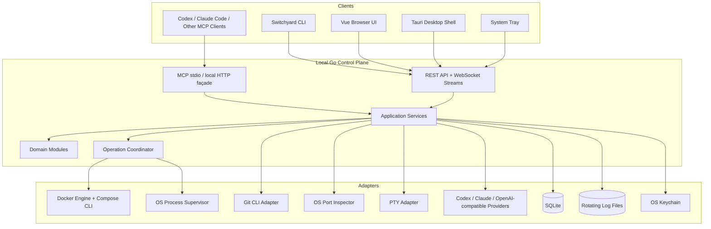

# Switchyard — Full Implementation Plan

> **Product:** Switchyard  
> **Positioning:** A local, project-oriented development command center  
> **Primary implementation language:** Go  
> **Primary UI stack:** Vue 3 + TypeScript  
> **Desktop shell:** Tauri 2  
> **Architecture:** Local-first modular monolith with strict domain boundaries  
> **Agent strategy:** MCP-first, provider-neutral, schema-constrained, least-privilege  
> **Document status:** Implementation blueprint  
> **Last updated:** 2026-07-16

---

## 1. Executive summary

Switchyard is a local control plane for software projects. It organizes local development around **projects and workspaces**, rather than around individual terminal tabs, Docker containers, or operating-system processes.

A project registered in Switchyard can describe and expose:

- Its Git repository and current source-control state.
- How to start, stop, restart, pause, rebuild, and tear down its runtime.
- Docker Compose services and/or host processes.
- Declared, reserved, and currently bound ports.
- Application URLs and health checks.
- Live and historical logs.
- CPU, memory, network, disk, image, and volume usage.
- Quick actions such as opening a terminal, VS Code, Codex, Claude Code, tests, migrations, or a browser.
- Relationships to other projects inside a workspace.
- Safe, typed operations that coding agents can invoke through MCP.

The core product is a long-running, local **Go agent**. The CLI, browser UI, Tauri desktop application, system tray, and MCP server are clients or façades over the same application services. No business logic belongs exclusively in a UI or agent integration.

The implementation will be a **modular monolith**, not a collection of premature microservices. Each domain owns its model, use cases, persistence interfaces, and adapter contracts. Cross-domain communication occurs through explicit application interfaces or typed events. There will be no generic `utils` dumping ground, no global mutable service locator, and no god object that knows how to scan projects, run Docker, tail logs, manage Git, and serve HTTP.

The first useful release will support macOS, Docker Compose projects, and ordinary host processes. Later phases add Linux, Windows/WSL, workspaces, worktrees, embedded terminals, richer agent sessions, an adapter/plugin SDK, AI troubleshooting, local reverse proxying, and optional remote agents.

---

## 2. Product definition

### 2.1 Problem statement

Developers with many local projects commonly accumulate inconsistent workflows:

- One project starts with `docker compose up -d`.
- Another starts with `uv run fastapi dev`.
- Another requires an npm frontend, Python API, database, and worker in separate terminals.
- Logs live in different containers, terminal tabs, files, or tools.
- Ports are assigned by memory and collide later.
- Docker Desktop shows containers but not the developer's project-level intent.
- Git status, local URLs, health, resource consumption, and lifecycle actions are fragmented.
- Coding agents must rediscover how a project runs, often by guessing from README files and scripts.

Switchyard creates a stable local project model and a single operational surface for humans and agents.

### 2.2 Product vision

> Register a project once, then never again have to remember how it starts, where its logs are, which ports it uses, how to verify it, or which terminal directory to open.

### 2.3 Primary personas

1. **Independent developer with many applications**  
   Wants a visual overview, fast lifecycle controls, logs, port awareness, resource visibility, and convenient terminal/editor actions.

2. **Engineering leader or staff engineer**  
   Wants repeatable local environments, consistent project onboarding, diagnostics, and maintainable operational definitions.

3. **AI-assisted developer**  
   Wants Codex, Claude Code, and other agents to understand and operate projects using stable typed tools rather than guessed shell commands.

4. **Open-source contributor**  
   Wants a low-friction installation, discoverable architecture, documented extension points, and trustworthy local-only behavior.

### 2.4 Goals

- Be project-first rather than container-first.
- Work with existing repositories without requiring them to be restructured.
- Support Docker and non-Docker projects equally well.
- Preserve terminal-centric workflows instead of replacing them.
- Detect and explain project state, including externally started processes.
- Prevent port collisions before startup.
- Aggregate logs and resources at project and service levels.
- Make agent operation reliable through MCP and machine-readable CLI contracts.
- Generate project configuration through deterministic scanning plus optional AI assistance.
- Remain local-first and useful without any cloud account.
- Be code that maintainers are proud to extend.

### 2.5 Non-goals for the initial product

- Replacing Docker Desktop completely.
- Becoming a full Git GUI.
- Becoming a production deployment platform.
- Becoming a general-purpose remote infrastructure orchestrator.
- Automatically rewriting arbitrary source files to change ports.
- Running untrusted repository commands without explicit approval.
- Requiring AI for basic project registration or operation.
- Providing a generic unrestricted remote shell to agents.
- Introducing microservices before independent deployment is genuinely required.

### 2.6 Product success measures

Track these locally and expose them to the user; do not send telemetry unless the user explicitly opts in later.

- Time from repository selection to a validated project proposal.
- Percentage of projects onboarded without manual manifest editing.
- Successful start-to-healthy rate.
- Number of port conflicts detected before process launch.
- Median time to reach the relevant error log.
- Percentage of project operations invoked from CLI, UI, tray, and MCP.
- Frequency of configuration drift or failed reconciliation.
- Crash-free daemon sessions.
- Resource overhead while idle and while monitoring.
- Number of project-specific lifecycle commands agents no longer need to rediscover.

---

## 3. Product principles

### 3.1 Project-first

The top-level entity is a project, not a container. Containers, services, processes, repositories, ports, logs, and health checks belong to or relate to a project.

### 3.2 Local-first

All essential functionality works offline. State is stored locally. Cloud services are optional integrations, never prerequisites.

### 3.3 Agent-native, not agent-dependent

Every core operation is available through typed application services, CLI JSON, and MCP. AI may help interpret ambiguity, but deterministic discovery and ordinary project operation do not require a model.

### 3.4 Safe by default

- Newly discovered repositories are untrusted until approved.
- Commands use argument arrays, not shell strings, by default.
- Destructive actions are distinct from ordinary stop actions.
- Secrets are never stored in manifests or ordinary SQLite fields.
- The daemon binds only to local IPC and loopback interfaces by default.
- Agents do not receive a general `run_any_shell_command` MCP tool.

### 3.5 Explainable

Switchyard should explain where each fact came from:

- `compose.yaml`
- `package.json` script
- `.switchyard/project.yml`
- process table
- Docker label
- AI proposal
- user override

The UI should display evidence and confidence during onboarding and diagnostics.

### 3.6 Non-invasive

Switchyard observes first. It does not silently edit repository files, delete Docker resources, install certificates, or change shell configuration.

### 3.7 Composable

The daemon, CLI, UI, desktop shell, MCP server, and provider integrations are separate adapters over shared application services.

---

## 4. Engineering quality bar

This section is normative. Codex, Claude Code, human contributors, and pull-request reviewers must treat these rules as implementation constraints.

### 4.1 Architecture style: modular monolith

Use one deployable Go control-plane binary with strict packages grouped by domain. The Tauri shell remains thin and contains no business rules. The Vue application contains presentation and client-side interaction logic, not runtime orchestration logic.

A domain module may contain:

```text
internal/<domain>/
├── domain/          # Entities, value objects, invariants, domain errors
├── application/     # Use cases, commands, queries, ports/interfaces
├── adapters/        # SQLite, Docker, OS, Git, HTTP, or provider implementations
└── contract/        # Public DTOs/events when another module requires them
```

Do not create all four directories reflexively. A small module may begin with two or three files and grow only when the separation adds clarity. The dependency direction still applies.

### 4.2 Dependency rule

```text
Transport/UI adapters
        ↓
Application use cases
        ↓
Domain model

Infrastructure adapters ──implement──> application ports
```

Domain packages must not import:

- SQL drivers
- Docker clients
- HTTP frameworks
- CLI libraries
- Tauri concepts
- Vue/TypeScript concepts
- Codex or Claude SDKs
- Operating-system command implementations

### 4.3 Domain boundaries

The initial bounded contexts are:

| Domain | Responsibility | Owns persistence for |
|---|---|---|
| `catalog` | Projects, locations, tags, discovery approval | projects, locations, tags |
| `manifest` | Parsed configuration, overlays, schema versions, proposals | manifest snapshots, proposal evidence |
| `operations` | Durable operation records, serialization, cancellation, progress | operations, operation steps |
| `runtime` | Runtime driver contracts and lifecycle execution | runtime bindings, runs, processes |
| `observability` | Logs, health, events, metrics, retention | health samples, metric samples, log segment metadata |
| `ports` | Declared/reserved/bound ports and conflict analysis | port declarations, leases, reservations |
| `sourcecontrol` | Git status, remotes, worktrees, repository metadata | Git snapshots only when history is enabled |
| `actions` | Safe project actions, editor/browser/terminal launch definitions | action definitions, action runs |
| `workspace` | Multi-project dependency graphs and coordinated startup | workspaces and membership |
| `agents` | MCP façade, AI provider adapters, skills, agent session metadata | provider profiles, proposals, sessions, audit events |
| `platform` | OS capability adapters; no product policy | no direct domain ownership |

Rules:

- A domain cannot read another domain's tables directly.
- Cross-domain access goes through an application interface or a typed event.
- Shared code is limited to stable primitives such as `Clock`, IDs, pagination, typed errors, and event envelopes.
- Never add `internal/utils`, `internal/common`, or `internal/helpers` as a miscellaneous package.
- Interfaces live with the consuming application package, not automatically beside the implementation.
- Introduce an interface only for a real boundary, alternate implementation, test seam, or provider contract.

### 4.4 No god files or classes

Soft review thresholds:

- Go source file: target below 400 lines; review required above 600; generated files excluded.
- Go function: target below 40 logical lines; extract only when the resulting function has a coherent name and responsibility.
- Vue single-file component: target below 250 lines excluding styles; split by responsibility, not arbitrary line count.
- Application service: one cohesive use case or closely related command family.
- HTTP handler: validation and translation only; no lifecycle orchestration.
- Runtime driver: delegate command construction, process tracking, and state reconciliation to focused collaborators.

A line threshold is a review signal, not permission to create dozens of meaningless wrappers.

### 4.5 DRY, KISS, and YAGNI

**DRY:** Remove duplicated knowledge, not every repeated line. Two similar code paths may stay separate until their shared abstraction is stable.

**KISS:** Prefer explicit typed code over reflection-heavy frameworks, service locators, hidden lifecycle hooks, or magical config merging.

**YAGNI:** Do not implement Kubernetes, remote hosts, cloud sync, or plugin marketplaces inside early phases. Design extension seams, then implement them only in the scheduled phase.

### 4.6 Additional mandatory practices

- No global mutable state.
- Constructor injection at composition roots.
- Context propagation and cancellation for I/O and long-running operations.
- Errors wrapped with operation context and mapped to typed domain/API errors.
- UTC internally; local timezone only at presentation boundaries.
- Stable IDs; never use display names as primary identifiers.
- Every destructive operation has a dry-run or preview where technically possible.
- Every long-running operation has progress, cancellation semantics, and an audit record.
- Do not log secrets, environment values, authentication headers, or full command lines containing secret arguments.
- Generated code is isolated and clearly marked.
- Every architecture exception requires an ADR.

### 4.7 Enforced quality gates

Go:

```text
gofmt
go vet
golangci-lint with depguard, staticcheck, errcheck, ineffassign,
gocritic, bodyclose, nilerr, exhaustive, revive, and complexity checks
go test ./...
go test -race ./...
govulncheck ./...
```

Frontend:

```text
pnpm lint
pnpm typecheck
pnpm test
pnpm test:e2e
pnpm test:visual
```

Repository:

```text
manifest/schema generation is clean
OpenAPI-generated clients are current
SQLite migrations apply from an empty database and upgrade fixtures
architecture dependency tests pass
secret scan passes
license/header checks pass
```

### 4.8 Architecture tests

Add automated checks that fail when:

- A domain package imports another domain's adapter or persistence package.
- `domain` imports `application` or `adapters`.
- HTTP handlers import Docker or process packages directly.
- UI code calls undocumented endpoints.
- handwritten TypeScript API types duplicate generated contract types.
- a new `utils`, `common`, or `helpers` root package appears.
- an MCP tool bypasses an application use case.

Implement the Go dependency check with a small repository-owned tool based on `go list -json -deps`, not an opaque external policy engine.

---

## 5. Chosen system architecture

### 5.1 Process topology



### 5.2 One Go binary

Ship one primary executable named `switchyard`.

```text
switchyard daemon
switchyard ui
switchyard list
switchyard add <path>
switchyard start <project>
switchyard logs <project>
switchyard ports
switchyard mcp serve
switchyard doctor
```

Benefits:

- One version to distribute.
- Tauri can package the same binary as a sidecar.
- The CLI and MCP server can attach to the daemon or start it when permitted.
- Shared configuration, auth, logging, and version negotiation.

Do not place all commands in one package. `cmd/switchyard` is the composition root; command groups delegate to client/application packages.

### 5.3 Local transport strategy

Use two transport layers over the same HTTP handlers/application services:

1. **Privileged local IPC** for CLI, MCP façade, and Tauri.
   - Unix domain socket on macOS/Linux.
   - Named pipe on Windows.
   - File permissions restrict access to the current user.

2. **Loopback HTTP** for the browser UI.
   - Bind only to `127.0.0.1` and `::1`.
   - Serve the built Vue application from the Go daemon.
   - Issue a short-lived same-origin session cookie after a local bootstrap handshake.
   - Require CSRF protection for mutations.

Do not expose the Docker socket or arbitrary process execution to browser JavaScript.

### 5.4 API choice

Use:

- REST JSON under `/api/v1` for commands and queries.
- WebSocket endpoints for live events, logs, PTYs, and agent sessions.
- OpenAPI as the transport contract.
- Generated Go transport types/interfaces and generated TypeScript clients.
- RFC 9457-style problem details for errors.

Why REST rather than placing gRPC throughout the product:

- Easy inspection and contribution.
- Natural browser support.
- Straightforward CLI and plugin integration.
- WebSocket is required for PTY sessions regardless.
- Keeps the local tool understandable and debuggable.

### 5.5 Persistence

Use SQLite with:

- A pure-Go driver to simplify cross-compilation.
- `sqlc` for typed queries.
- Embedded, forward-only migrations.
- WAL mode.
- Foreign keys enabled.
- Explicit transaction boundaries in application use cases.

Store large log bodies outside SQLite as rotating files. SQLite stores segment metadata, time ranges, service/run identity, checksums, and optional search indexes.

Secrets are stored in the operating-system keychain. SQLite stores only a secret reference such as `keychain://switchyard/provider/openai`.

### 5.6 Eventing and operations

Use a lightweight typed in-process event broker. Do not introduce Kafka, NATS, Redis, or another daemon.

Lifecycle operations are durable records:

```text
queued → running → succeeded
                 ↘ failed
                 ↘ cancelled
                 ↘ partially_succeeded
```

Serialize lifecycle mutations per project using a keyed operation lock. Read-only queries may run concurrently. Workspaces may operate on independent projects in parallel while respecting dependency order and per-project locks.

### 5.7 Application state reconciliation

Switchyard must handle state it did not create.

A project state is derived from driver observations, health, and expected topology:

```text
unknown
stopped
starting
running
running_external
partially_running
degraded
paused
stopping
failed
```

Never trust a stored PID alone. Verify process identity using PID, executable, start time, working directory where available, expected port, and Switchyard run metadata.

---

## 6. Technology stack

### 6.1 Go control plane

| Concern | Choice | Rationale |
|---|---|---|
| Language | Current stable Go, pinned in `go.mod` and tool config | Single binaries, concurrency, cross-platform systems work |
| CLI | Cobra, without Viper | Mature command structure; avoid hidden configuration magic |
| HTTP | `net/http` + Chi | Small, idiomatic router |
| Logging | Standard `log/slog` | Structured logging without another logging framework |
| API contract | OpenAPI + `oapi-codegen` | Generated Go/TypeScript transport contracts |
| Database | SQLite, pure-Go driver | Local-first, portable, no external database |
| SQL | `sqlc` | Typed SQL without ORM magic |
| Migrations | Embedded Goose migrations | Reviewable schema evolution |
| Docker observation | Official Docker Go SDK with API negotiation | Events, stats, logs, inspect |
| Compose lifecycle | Installed `docker compose` CLI | Matches user contexts, credentials, plugins, and Compose behavior |
| Filesystem watching | `fsnotify` | Project and manifest refresh |
| Host metrics | `gopsutil` behind platform interface | Cross-platform process/host metrics |
| PTY | `creack/pty` on Unix; platform adapter for Windows | Embedded interactive sessions |
| MCP | Official MCP Go SDK | Provider-neutral typed agent tools |
| Tests | Standard testing, `go-cmp`, Testcontainers when needed | Clear tests and real adapter coverage |

Dependency versions must be pinned by the repository and updated intentionally. Do not encode transient version numbers in this plan as architectural requirements.

### 6.2 Web application

| Concern | Choice |
|---|---|
| Framework | Vue 3 Composition API |
| Language | TypeScript with strict mode |
| Build | Vite |
| Package manager | pnpm with locked version |
| Routing | Vue Router |
| Server state | TanStack Vue Query |
| Local UI state | Pinia only where state is not server-owned |
| Terminal | xterm.js |
| Resource charts | uPlot or an equivalently lightweight time-series renderer |
| Icons | Lucide Vue |
| Styling | CSS custom properties + component-scoped CSS; no utility-class wall |
| Unit tests | Vitest + Vue Testing Library |
| End-to-end | Playwright |
| Accessibility | axe integration and keyboard-first command palette |

### 6.3 Desktop application

- Tauri 2.
- Minimal Rust glue only.
- Go binary bundled as an external sidecar.
- System tray.
- Optional autostart.
- Native notifications.
- Signed updater.
- Deep links such as `switchyard://project/league-lore` in a later phase.

The Tauri shell must not reimplement project or Docker logic.

### 6.4 Build and release

- GitHub Actions.
- GoReleaser for CLI/daemon archives and checksums.
- Tauri build pipeline for signed desktop bundles.
- macOS signing and notarization before public beta.
- Windows signing before Windows GA.
- Linux AppImage/deb/rpm after Linux adapter hardening.
- SBOM generation.
- Signed release artifacts and provenance.
- Apache-2.0 license for patent clarity and open-source use.

---

## 7. Repository structure

```text
switchyard/
├── AGENTS.md
├── CLAUDE.md
├── README.md
├── LICENSE
├── CONTRIBUTING.md
├── SECURITY.md
├── CODE_OF_CONDUCT.md
├── Makefile
├── go.mod
├── go.sum
├── pnpm-workspace.yaml
├── package.json
├── api/
│   ├── openapi.yaml
│   └── async-events.md
├── schemas/
│   ├── project-manifest.schema.json
│   ├── manifest-proposal.schema.json
│   └── plugin-protocol.schema.json
├── cmd/
│   └── switchyard/
│       └── main.go
├── internal/
│   ├── bootstrap/
│   ├── catalog/
│   ├── manifest/
│   ├── operations/
│   ├── runtime/
│   │   ├── contract/
│   │   ├── compose/
│   │   └── process/
│   ├── observability/
│   │   ├── logs/
│   │   ├── health/
│   │   └── metrics/
│   ├── ports/
│   ├── sourcecontrol/
│   ├── actions/
│   ├── workspace/
│   ├── agents/
│   │   ├── mcp/
│   │   ├── providers/
│   │   ├── proposals/
│   │   └── sessions/
│   ├── platform/
│   │   ├── darwin/
│   │   ├── linux/
│   │   └── windows/
│   ├── transport/
│   │   ├── httpapi/
│   │   ├── websocket/
│   │   └── ipc/
│   └── foundation/
│       ├── clock/
│       ├── eventing/
│       ├── ids/
│       └── problem/
├── migrations/
├── queries/
├── web/
│   ├── src/
│   │   ├── app/
│   │   ├── api/generated/
│   │   ├── domains/
│   │   ├── components/
│   │   ├── composables/
│   │   ├── router/
│   │   └── styles/
│   └── tests/
├── desktop/
│   └── src-tauri/
├── agent-guidance/
│   ├── skills/
│   ├── codex/
│   └── claude/
├── examples/
│   ├── compose-project/
│   ├── uv-project/
│   └── mixed-project/
├── test/
│   ├── integration/
│   ├── e2e/
│   ├── fixtures/
│   └── architecture/
├── tools/
│   ├── archcheck/
│   ├── schema-gen/
│   └── fixture-builder/
└── docs/
    ├── architecture/
    ├── adr/
    ├── implementation/
    ├── user-guide/
    └── progress/
```

### 7.1 Frontend organization

Organize by product domain rather than by generic component type alone:

```text
web/src/domains/projects/
├── api.ts
├── routes.ts
├── queries.ts
├── components/
├── views/
├── model.ts
└── tests/
```

Shared visual primitives belong in `web/src/components/ui`. A component moves there only after it is genuinely reusable. Do not begin by creating a large generic design-system abstraction for every `<div>`.

---

## 8. Core domain model

### 8.1 Project

```text
Project
- id
- slug
- display_name
- description
- trust_state
- primary_location
- tags
- manifest_revision
- created_at
- updated_at
```

A project can have multiple locations later, such as worktrees. The first phase supports one primary repository location.

### 8.2 Service

A service is a project-visible runtime unit:

```text
Service
- id
- project_id
- key
- display_name
- runtime_kind: compose_service | host_process | external
- desired_state
- observed_state
- dependencies
```

Do not mirror every Docker field into the domain. Docker-specific inspect data stays in adapter DTOs or observation snapshots.

### 8.3 Run

```text
Run
- id
- project_id
- service_id optional
- runtime_driver
- origin: switchyard | external | agent
- started_at
- ended_at
- exit_code
- termination_reason
- identity_fingerprint
```

### 8.4 Operation

```text
Operation
- id
- project_id optional
- workspace_id optional
- kind
- risk_level
- requested_by: user_cli | user_ui | tray | mcp | system
- state
- progress
- created_at
- started_at
- completed_at
- error_code
- error_summary
```

### 8.5 Port facts

Keep three concepts distinct:

- **Declaration:** configuration says a service expects a port.
- **Reservation/lease:** Switchyard assigns or protects a port even while stopped.
- **Binding:** the operating system currently has a listener.

A conflict is derived when incompatible declarations, reservations, or bindings overlap.

### 8.6 Manifest proposal

```text
ManifestProposal
- id
- project_id
- scanner_version
- provider_kind optional
- schema_version
- candidate_document
- evidence_items
- confidence_by_field
- validation_results
- status: proposed | accepted | rejected | superseded
```

### 8.7 Suggested SQLite tables

```text
projects
project_locations
project_tags
manifest_snapshots
manifest_proposals
discovery_evidence
services
runtime_bindings
runs
run_processes
operations
operation_steps
health_check_definitions
health_samples
metric_samples
log_segments
port_declarations
port_reservations
port_bindings_snapshot
action_definitions
action_runs
git_snapshots
workspaces
workspace_projects
workspace_dependencies
agent_provider_profiles
agent_sessions
audit_events
settings
```

Status that can be derived from current observations should not become a permanently authoritative column merely for UI convenience.

---

## 9. Project manifest system

### 9.1 User experience

Users should normally never author YAML manually.

```text
Select repository
      ↓
Deterministic scan
      ↓
Optional AI interpretation
      ↓
Evidence-backed proposal
      ↓
Validation and dry-run
      ↓
Human review
      ↓
Approved project definition
```

### 9.2 Files

Recommended repository-local files:

```text
.switchyard/project.yml          # portable, generated and reviewable
.switchyard/project.local.yml    # machine-specific overlay, gitignored
```

Switchyard may operate zero-config projects from its database, but should offer exporting a portable manifest.

### 9.3 Source precedence

Highest wins:

1. Runtime user override for the current operation.
2. `.switchyard/project.local.yml`.
3. `.switchyard/project.yml`.
4. Accepted generated inference stored in SQLite.
5. Live deterministic discovery.

Every effective field should retain provenance.

### 9.4 Sample manifest

```yaml
schemaVersion: switchyard.dev/v1alpha1
kind: Project

metadata:
  id: league-lore
  name: LeagueLore
  description: Fantasy football history and analytics
  tags: [python, vue, docker]

repository:
  root: .
  defaultBranch: main

runtime:
  driver: compose
  compose:
    files: [compose.yaml]
    projectName: league_lore

lifecycle:
  start:
    action: compose.up
    options:
      detached: true
  stop:
    action: compose.stop
  restart:
    action: compose.restart
  rebuild:
    action: compose.up
    options:
      build: true
      recreate: true
      detached: true
  teardown:
    action: compose.down
    risk: destructive

services:
  - id: api
    source:
      composeService: api
    healthChecks:
      - type: http
        url: http://127.0.0.1:${ports.api}/health
        expectedStatus: 200

  - id: web
    source:
      composeService: web

ports:
  - id: api
    service: api
    host: 15173
    target: 8000
    protocol: tcp

  - id: web
    service: web
    host: 15174
    target: 5173
    protocol: tcp

endpoints:
  - id: app
    name: Application
    url: http://127.0.0.1:${ports.web}
    primary: true

  - id: api
    name: API
    url: http://127.0.0.1:${ports.api}

actions:
  - id: terminal
    name: Open Terminal
    type: terminal.open
    workingDirectory: .

  - id: vscode
    name: Open VS Code
    type: command
    command: [code, .]

  - id: codex
    name: Start Codex
    type: agent.start
    provider: codex

  - id: tests
    name: Run Tests
    type: command
    command: [uv, run, pytest]
    captureOutput: true

resourcePolicy:
  warnings:
    memoryMiB: 2500
    cpuPercent: 40
    storageGiB: 10
```

### 9.5 Manifest implementation rules

- Parse YAML into typed Go structs.
- Generate JSON Schema from the canonical Go model and commit the generated file.
- CI fails if schema generation changes the repository.
- Unknown fields are errors by default.
- Include explicit schema versions and migration support.
- Validate paths remain within approved project roots unless explicitly allowed.
- Commands are arrays; shell interpretation requires `shell: true` and a warning.
- Environment values may reference secrets but never contain them in exported manifests.
- Template expansion has a small documented grammar; do not invent a general scripting language.
- `switchyard manifest explain <project>` prints the effective value and provenance for each field.
- `switchyard manifest diff <project>` compares source, local overlay, and effective config.

---

## 10. Deterministic discovery

### 10.1 Scanner pipeline

Use independent scanners that emit evidence, not a single giant repository scanner.

```text
RepositoryScanner
├── GitScanner
├── ComposeScanner
├── DockerfileScanner
├── PythonScanner
├── NodeScanner
├── MakeScanner
├── JustScanner
├── DevContainerScanner
├── ReadmeScanner
├── ExistingRuntimeScanner
└── PortReferenceScanner
```

Each scanner returns:

```go
type Evidence struct {
    Kind       string
    SourcePath string
    Location   SourceRange
    Confidence float64
    Data       json.RawMessage
    Warnings   []string
}
```

A separate proposal builder combines evidence according to deterministic rules. AI is not embedded inside scanners.

### 10.2 Files to inspect

```text
.git/
compose.yaml
compose.yml
docker-compose.yaml
docker-compose.yml
Dockerfile*
package.json
pnpm-workspace.yaml
pyproject.toml
uv.lock
requirements*.txt
Makefile
justfile
Procfile
.env.example
README*
AGENTS.md
CLAUDE.md
.devcontainer/
go.mod
Cargo.toml
pom.xml
build.gradle*
```

### 10.3 Discovery safety

- Reading ordinary project files is allowed after the user selects or trusts the root.
- Do not execute repository scripts during scanning.
- Do not read `.env`, private keys, credentials, browser profiles, or arbitrary home-directory files.
- Redact suspected secrets from evidence.
- Limit file size and depth.
- Treat README and log content as untrusted text, particularly when sent to an AI provider.
- Show every proposed executable command before approval.

### 10.4 Validation pipeline

A candidate must pass:

1. JSON Schema validation.
2. Domain invariant validation.
3. Path containment validation.
4. Executable availability checks.
5. Port syntax and conflict analysis.
6. Compose normalization using `docker compose config` when applicable.
7. Lifecycle semantic validation.
8. Health-check syntax validation.
9. Secret-reference validation.
10. Dry-run command construction.

No candidate is executed merely because an AI returned valid JSON.

---

## 11. Runtime driver architecture

### 11.1 Driver contract

```go
type Driver interface {
    Kind() Kind
    Inspect(ctx context.Context, project ProjectRuntime) (Observation, error)
    Plan(ctx context.Context, req PlanRequest) (Plan, error)
    Execute(ctx context.Context, plan Plan, sink ProgressSink) (Result, error)
    StreamLogs(ctx context.Context, req LogRequest, sink LogSink) error
    StreamMetrics(ctx context.Context, req MetricRequest, sink MetricSink) error
}
```

`Plan` is important. The UI, CLI, and agents can preview what an operation will do before it runs.

### 11.2 Docker Compose driver

Use the Docker SDK for observation and streams:

- Container list and inspect.
- Docker events.
- Resource stats.
- Container logs.
- Image and volume metadata.

Use the installed `docker compose` CLI for lifecycle:

- Honors the user's Docker context and credentials.
- Behaves like the commands the user already trusts.
- Avoids reimplementing all Compose semantics.

Normalize project identity using Compose project/service labels. Never infer membership from container-name prefixes alone.

Responsibilities should be split:

```text
ComposeCommandBuilder
ComposeExecutor
ComposeConfigReader
DockerObserver
DockerEventWatcher
DockerLogSource
DockerMetricSource
ComposeReconciler
```

### 11.3 Native process driver

The process driver supports ordinary commands such as:

```text
uv run fastapi dev app/main.py --port 18082
pnpm dev
./scripts/dev
make serve
```

Requirements:

- Create an OS process group/job object.
- Capture stdout and stderr separately.
- Record PID, executable, start time, cwd, and run ID.
- Send graceful termination first, then escalate after a configured timeout.
- Reconcile orphaned or externally launched processes.
- Support restart policies only when explicitly enabled.
- Never assume a process has stopped because the parent PID exited.
- No shell by default.

### 11.4 External runtime observation

Switchyard may observe processes or containers started outside the application and label them:

```text
Running externally
Partially managed
Logs unavailable
Stop action requires adoption or explicit confirmation
```

Do not claim ownership over a process until the user adopts it or Switchyard can safely map it to a declared service.

### 11.5 Pause semantics

- Docker containers may expose pause/unpause.
- Host processes do not receive a generic pause button in the initial release.
- A process project can define explicit pause/resume actions if the developer knows they are safe.
- UI labels must distinguish `stop`, `pause`, `teardown`, and `reset data`.

---

## 12. Logs, health, events, and metrics

### 12.1 Log event model

```json
{
  "timestamp": "2026-07-16T04:00:00.123Z",
  "projectId": "league-lore",
  "serviceId": "api",
  "runId": "01...",
  "source": "docker",
  "stream": "stdout",
  "level": "info",
  "message": "Application startup complete",
  "attributes": {}
}
```

Level detection is best-effort and must never mutate the original line.

### 12.2 Log storage

Initial implementation:

- In-memory bounded ring buffer per active service.
- Rotating newline-delimited JSON files per run.
- Segment metadata in SQLite.
- User-configurable retention by age and disk cap.
- Export as plain text or NDJSON.

Later:

- Compression of closed segments.
- Optional FTS indexing.
- Cross-project search.
- Saved filters.

### 12.3 Secret redaction

Apply redaction to UI display, persisted logs, AI evidence bundles, and exported diagnostics. Support:

- Known secret references.
- Environment variable names matching secret patterns.
- Bearer tokens and common credential formats.
- User-defined regular expressions.

Show that redaction occurred without revealing the value.

### 12.4 Health checks

Supported check types:

- HTTP status and optional JSON-path assertion.
- TCP connect.
- Process alive.
- Docker health status.
- Command check with strict timeout.
- Composite all/any.

Health evaluation includes initial delay, interval, timeout, retries, and severity.

### 12.5 Metrics

Project and service metrics:

- CPU percent.
- Resident memory.
- Network I/O.
- Disk I/O where available.
- Process/container count.
- Restart count.
- Health latency.
- Project storage estimate.

Sample frequently for live display, then downsample for history. Do not retain high-frequency samples indefinitely.

### 12.6 Storage attribution honesty

Docker layers and volumes may be shared. Label values as:

- Exclusive.
- Shared.
- Estimated.
- Unknown.

Never present shared image-layer bytes as an exact project-exclusive total.

---

## 13. Port registry

### 13.1 Sources

- Accepted manifests.
- Compose configuration.
- package scripts and known CLI flags.
- Local overlays.
- Live OS listeners.
- Docker published ports.
- Switchyard reservations and leases.

### 13.2 Conflict types

```text
DECLARED_VS_DECLARED
DECLARED_VS_RESERVED
DECLARED_VS_BOUND
RESERVED_VS_RESERVED
BOUND_BY_UNKNOWN_PROCESS
PROTOCOL_MISMATCH
HOST_ADDRESS_OVERLAP
```

### 13.3 Port suggestion

Allow configurable preferred ranges. A suggestion must consider declarations, reservations, live bindings, excluded ports, and worktree leases.

```bash
switchyard ports next --range 15000-19999 --project pulse --json
```

### 13.4 Safe remediation

Initial behavior:

- Explain the conflict.
- Show where each declaration came from.
- Suggest a free port.
- Copy an environment override.

Later adapters may make targeted changes to known configuration formats, but always through a reviewable patch. Never perform broad search-and-replace across a repository.

### 13.5 Local reverse proxy

A later phase introduces optional names such as:

```text
http://leaguelore.localhost
http://familyhub.localhost
```

Use Go's reverse proxy support and a local routing registry. Start with HTTP. Local TLS and certificate installation are separate opt-in features with clear OS prompts.

---

## 14. Git and developer actions

### 14.1 Git strategy

Use the installed Git CLI. Parse stable porcelain formats.

Expose:

- Current branch or detached head.
- Dirty file count and categories.
- Ahead/behind counts.
- Last commit.
- Remotes.
- Stashes.
- Worktrees.
- Merge/rebase state.

Do not build a full commit or merge UI initially.

### 14.2 Safe actions

Built-in action types:

```text
terminal.open
editor.open
browser.open
command.run
agent.start
git.fetch
git.pull
git.push
tests.run
migration.run
```

Project actions are declarative and risk-classified:

```text
read_only
mutating
networked
destructive
interactive
```

### 14.3 Command execution rules

- Argument arrays by default.
- Explicit working directory.
- Explicit environment allowlist/overlay.
- Timeout and cancellation.
- Output capture policy.
- Risk declaration.
- User confirmation for destructive actions.
- No hidden `sudo` or privilege escalation.

---

## 15. Agent-native architecture

Agent support is a first-class contract, not a collection of prompt snippets.

### 15.1 Integration layers

1. **MCP server:** typed project context and operations.
2. **Machine-readable CLI:** stable automation fallback.
3. **Skills/instructions:** explain preferred workflows to agents.
4. **AI provider adapters:** optional repository interpretation and diagnostics.
5. **Agent session launcher:** open Codex, Claude Code, or generic tools inside a project.

### 15.2 MCP server

Run locally:

```bash
switchyard mcp serve --transport stdio
```

Optional later transport:

```bash
switchyard mcp serve --transport streamable-http --local-only
```

The MCP façade calls application services. It must never call Docker, SQL, or `os/exec` directly.

### 15.3 MCP tools

Read-only tools:

```text
switchyard_system_info
switchyard_projects_list
switchyard_project_get
switchyard_project_status
switchyard_project_services
switchyard_project_logs_query
switchyard_project_health
switchyard_project_git_status
switchyard_ports_list
switchyard_ports_suggest
switchyard_actions_list
switchyard_operation_get
switchyard_manifest_explain
```

Mutating tools:

```text
switchyard_project_start
switchyard_project_stop
switchyard_project_restart
switchyard_project_pause
switchyard_project_resume
switchyard_project_run_action
switchyard_workspace_start
switchyard_workspace_stop
switchyard_manifest_proposal_create
switchyard_manifest_proposal_accept
```

Destructive tools, disabled from default agent profiles:

```text
switchyard_project_teardown
switchyard_storage_cleanup
switchyard_volume_delete
switchyard_project_reset_data
```

Every tool includes accurate annotations such as read-only, destructive, idempotent, and open-world hints where supported. Mutations return an operation ID and structured progress rather than blocking indefinitely.

### 15.4 No generic shell MCP tool

Agents already have their own shell tools. Switchyard should expose the **project's declared operational vocabulary**, not another unrestricted command executor.

An agent may invoke `switchyard_project_run_action(actionId="tests")` only when that action is approved and visible in the project definition.

### 15.5 MCP resources

```text
switchyard://system
switchyard://projects
switchyard://projects/{id}
switchyard://projects/{id}/manifest
switchyard://projects/{id}/status
switchyard://projects/{id}/services
switchyard://projects/{id}/git
switchyard://projects/{id}/ports
switchyard://projects/{id}/recent-errors
switchyard://workspaces/{id}
```

Resources are compact, structured, and redacted. Do not dump unbounded logs or the whole SQLite database into model context.

### 15.6 MCP prompts/workflows

```text
onboard_project
diagnose_project
start_and_verify
review_port_conflicts
prepare_project_for_agent
analyze_resource_pressure
```

Prompts guide workflow, but safety is enforced in application services and permissions, not in prompt prose alone.

### 15.7 Agent permission profiles

Built-in profiles:

| Profile | Capabilities |
|---|---|
| `observe` | Read status, logs, Git, ports, health |
| `develop` | Observe + start/stop/restart + approved actions |
| `maintain` | Develop + rebuild + cleanup preview |
| `admin` | Explicit destructive actions; never default |

Profiles can be scoped per project and provider. Every agent-originated mutation is audited.

### 15.8 Codex integration

Provide:

- A Switchyard MCP configuration installer.
- A repository `AGENTS.md`.
- On-demand Agent Skills for implementation, diagnosis, onboarding, and UI verification.
- Noninteractive provider support using `codex exec` with read-only sandboxing and `--output-schema` for manifest proposals.
- Optional later integration with Codex App Server/SDK for richer session events.

Suggested user flow:

```bash
switchyard agent install codex
switchyard agent start league-lore --provider codex
```

Codex should use MCP for project operation and its own repository tools for source editing.

### 15.9 Claude Code integration

Provide:

- MCP installation/config generation.
- `CLAUDE.md` importing the shared `AGENTS.md`.
- Claude skills mirroring the open Agent Skills workflows.
- Noninteractive provider support using print mode, plan permissions, and JSON Schema output.
- Optional hooks that verify Switchyard health after agent changes, but only when the user enables them.

### 15.10 Other agents

Remain provider-neutral:

```go
type ProposalProvider interface {
    ID() string
    Availability(ctx context.Context) Availability
    ProposeManifest(ctx context.Context, req ProposalRequest) (ProposalResult, error)
    Diagnose(ctx context.Context, req DiagnosisRequest) (DiagnosisResult, error)
}
```

Initial adapters:

- Codex CLI.
- Claude Code CLI.
- Generic OpenAI-compatible HTTP endpoint for local or hosted models.
- `none`, meaning deterministic-only.

Do not import provider concepts into catalog, manifest, runtime, or observability domains.

### 15.11 AI manifest generation

The AI receives a bounded evidence bundle, not unrestricted filesystem access from Switchyard.

```text
Scanner evidence
Known scripts and normalized Compose config
Relevant README excerpts
Current port map
Manifest JSON Schema
Explicit task instructions
```

Provider execution rules:

- Read-only or plan mode.
- No repository writes.
- No command execution unless the provider's sandbox is explicitly configured and the operation is purely inspectorial.
- No secret files.
- Structured output constrained by JSON Schema.
- Budget, turn, and timeout limits.
- Provider output treated as untrusted input.

The proposal UI shows field-level evidence and confidence.

### 15.12 Agent-generated project guidance

Switchyard may optionally generate:

```text
AGENTS.md additions
CLAUDE.md import
.agent/skills/switchyard-operate/SKILL.md
.claude/skills/switchyard-operate/SKILL.md
```

Prefer a single shared skill source with installation/symlink/copy adapters rather than duplicated divergent instructions.

### 15.13 Machine-readable CLI

Every query command supports `--json`. Streaming commands support JSON Lines.

```bash
switchyard status league-lore --json
switchyard logs league-lore --service api --since 10m --jsonl
switchyard start league-lore --json
```

Requirements:

- Stable documented schemas.
- Semantic exit codes.
- No color when output is not a TTY.
- No interactive prompt when `--non-interactive` is set.
- Mutations return operation IDs.
- `switchyard schema cli <command>` exposes the current output schema.

### 15.14 Agent session management

Later phases allow Switchyard to launch and observe agent sessions:

```text
Project: LeagueLore
Session: Codex — feature/import-redesign
Working directory: worktree path
Started: 10:42 PM
Status: active
```

The first implementation treats agents as PTY processes. Rich provider SDK integration comes later. Never attempt to capture or expose private chain-of-thought; store only public event streams, tool/command summaries, status, and user-visible output.

### 15.15 Prompt-injection defense

Logs, README files, issue text, and repository content can contain instructions aimed at an agent. Evidence bundles must clearly delimit them as untrusted data. Tool permissions are enforced independently of model output. Destructive operations require application-level authorization even when requested by an agent.

---

## 16. API outline

### 16.1 Representative endpoints

```text
GET    /api/v1/system
GET    /api/v1/projects
POST   /api/v1/projects
GET    /api/v1/projects/{projectId}
PATCH  /api/v1/projects/{projectId}
POST   /api/v1/projects/{projectId}/operations
GET    /api/v1/operations/{operationId}
POST   /api/v1/operations/{operationId}/cancel
GET    /api/v1/projects/{projectId}/services
GET    /api/v1/projects/{projectId}/logs
GET    /api/v1/projects/{projectId}/health
GET    /api/v1/projects/{projectId}/metrics
GET    /api/v1/projects/{projectId}/git
GET    /api/v1/ports
POST   /api/v1/ports/suggestions
POST   /api/v1/discovery/scans
GET    /api/v1/discovery/scans/{scanId}
POST   /api/v1/manifest-proposals
POST   /api/v1/manifest-proposals/{id}/validate
POST   /api/v1/manifest-proposals/{id}/accept
GET    /api/v1/workspaces
POST   /api/v1/workspaces/{id}/operations
GET    /api/v1/agents/providers
POST   /api/v1/agents/sessions
```

### 16.2 WebSocket endpoints

```text
/ws/v1/events
/ws/v1/logs
/ws/v1/terminal/{sessionId}
/ws/v1/agent-sessions/{sessionId}
```

### 16.3 Event envelope

```json
{
  "id": "01...",
  "type": "project.status.changed",
  "occurredAt": "2026-07-16T04:00:00Z",
  "sequence": 4132,
  "projectId": "league-lore",
  "payload": {}
}
```

Clients reconnect with the last sequence number. The daemon may replay a bounded event window and then require a full refresh.

### 16.4 Idempotency

Mutation requests accept an idempotency key. Duplicate start requests should attach to or return the existing operation rather than launch competing operations.

---

## 17. UI and design implementation specification

The interactive reference is located at:

```text
design/switchyard-interactive-mockup.html
```

Codex must open this file in a browser and use it as the visual reference. The production UI should reproduce its visual hierarchy and interactions while replacing mock data with real API state.

### 17.1 Design direction

- Dark, restrained, professional developer tooling.
- High information density without visual noise.
- Clear state colors and compact controls.
- Project identity is more prominent than container identity.
- Animation is subtle and functional.
- Keyboard navigation is first-class.

### 17.2 Design tokens

```css
:root {
  --bg: #0a0d12;
  --panel: #11161e;
  --panel-2: #151b24;
  --panel-3: #1a2230;
  --border: #253044;
  --text: #edf3fb;
  --muted: #91a0b5;
  --soft: #65748a;
  --accent: #78a6ff;
  --accent-2: #9e7bff;
  --green: #54d49a;
  --yellow: #f1c75b;
  --red: #ff7373;
  --cyan: #63d7e7;
}
```

Layout:

- Sidebar: 230px desktop, icon rail on narrow screens.
- Sticky top bar: 72px.
- Content padding: 28px desktop.
- Panels: 14–15px radius, 1px border.
- Project grid: two columns at wide widths, one column below approximately 1050px.
- Base font: system sans; code/logs: system monospace.

### 17.3 Primary routes

```text
/
/projects
/projects/:projectId
/ports
/resources
/logs
/workspaces
/discovery
/agents
/settings
```

### 17.4 Dashboard

Must include:

- Greeting/header and add/scan actions.
- Host CPU, memory, and Docker storage pills.
- Summary cards for running projects, memory, conflicts, and repository attention.
- Filterable/sortable project cards.
- Status, Git, endpoint, resources, services, and common actions.
- Keyboard command palette with `Cmd/Ctrl+K`.

### 17.5 Project detail

Tabs:

```text
Overview
Logs
Terminal
Git
Ports
Storage
Agents
Config
```

Overview contains:

- Project hero with status and lifecycle actions.
- Service table.
- Live logs preview.
- Health checks.
- Quick actions.
- Resource summary.

### 17.6 Port registry

- Summary cards.
- Visual port map.
- Conflict highlighting.
- Binding/declaration/reservation table.
- Suggested next free port.
- Evidence and remediation drawer.

### 17.7 Additional full-feature screens

- Unified log explorer.
- Resource history and pressure analysis.
- Project onboarding wizard.
- Manifest proposal review with evidence/confidence.
- Workspace graph and startup progress.
- Agent sessions.
- Settings for roots, preferred ranges, retention, terminal/editor, AI providers, permissions, and appearance.

### 17.8 UI state rules

Every screen must implement:

- Loading skeleton.
- Empty state.
- Partial data state.
- Disconnected daemon state.
- Permission denied state.
- Recoverable error with retry.
- Stale data indicator.
- Optimistic feedback only when rollback is safe.

### 17.9 Accessibility

- WCAG 2.2 AA target.
- Visible focus states.
- Full keyboard operation.
- Status conveyed by text/icon, not color alone.
- Reduced-motion preference.
- Screen-reader announcements for operation progress and log-follow state.
- Avoid excessively small hit targets despite compact styling.

### 17.10 Visual verification

Playwright visual tests should cover at least:

- Dashboard at 1440×1050.
- Project detail at 1440×1050.
- Port registry at 1440×1050.
- Narrow desktop/tablet layout.
- Empty, loading, error, degraded, and stopped states.

Store baselines generated from the production Vue application. The HTML mockup is a design reference, not the permanent test fixture.

---

## 18. Security and trust model

### 18.1 Trust boundaries

```text
Browser UI
Tauri UI
CLI user
MCP client / coding agent
Selected repository content
Local Docker daemon
Operating-system processes
External AI provider
Third-party plugin
```

Each boundary must have explicit authorization and data-redaction policy.

### 18.2 Repository trust

States:

```text
untrusted
review_pending
trusted
blocked
```

Untrusted repositories may be scanned using safe readers but cannot execute commands or install agent guidance.

### 18.3 API security

- Local IPC preferred.
- Loopback only for browser API.
- Random install/session secrets.
- Same-origin cookies and CSRF protection.
- Origin validation for WebSockets.
- No permissive CORS.
- Idle session expiration.
- Audit mutations.

### 18.4 Process security

- No shell by default.
- No implicit privilege elevation.
- Explicit cwd and environment.
- Path containment.
- Process groups/job objects.
- Timeouts and cancellation.
- Command preview and risk label.

### 18.5 Terminal security

Embedded terminals are high privilege. Require:

- Explicit user creation.
- Authenticated WebSocket.
- Session ownership.
- Origin checks.
- Bounded scrollback.
- Sanitized link handling.
- No terminal data injected into the surrounding DOM as HTML.
- Clear warning when an agent owns or shares the session.

### 18.6 Secrets

- OS keychain storage.
- References in manifests and SQLite.
- Redaction before logs or AI calls.
- No secret values in diagnostics bundles.
- Provider credentials scoped per provider.
- Secret access visible in audit logs without the secret value.

### 18.7 AI safety

- Provider calls are optional and explicit.
- Show which files/excerpts will be sent.
- Structured output only for automated ingestion.
- Validate everything after model output.
- Read-only provider mode for onboarding.
- Prompt-injection-resistant delimiters and instructions.
- Hard application permission checks.
- Budgets and timeouts.

### 18.8 Plugin security

Use out-of-process plugins later. Do not load arbitrary shared libraries into the daemon. Plugins declare capabilities, protocol version, executable path, and requested scopes. The user must trust and enable each plugin.

---

## 19. Testing strategy

### 19.1 Test pyramid

1. Domain unit tests for invariants and state derivation.
2. Application tests with focused fakes.
3. Adapter integration tests against real SQLite, Git repositories, processes, and Docker.
4. API contract tests.
5. UI component tests.
6. End-to-end tests using fixture projects.
7. Cross-platform acceptance tests.

### 19.2 Fixture projects

Maintain small, deterministic fixtures:

```text
compose-healthy
compose-degraded
compose-port-conflict
uv-single-process
node-single-process
mixed-compose-and-process
monorepo-two-apps
external-process
worktree-project
malicious-readme
secret-redaction
```

### 19.3 Docker tests

Use isolated Compose project names and dynamic ports. Cleanup must run even after failure. CI may separate Docker-required tests from ordinary unit tests.

### 19.4 Process tests

Test:

- Graceful stop.
- Forced termination.
- Child process trees.
- PID reuse resistance.
- Crash and restart behavior.
- Orphan reconciliation.
- stdout/stderr capture.
- cancellation.

### 19.5 Agent tests

- MCP conformance tests.
- MCP Inspector smoke tests.
- Tool permission profiles.
- Destructive-tool denial.
- Schema-constrained provider fixtures.
- Malformed and adversarial provider output.
- Prompt-injection fixture content.
- Stable CLI JSON snapshots.

### 19.6 Visual tests

Use production seeded API fixtures and compare primary pages against approved baselines. Avoid asserting incidental timestamps or random IDs.

### 19.7 Performance tests

Targets should be measured and refined:

- Low idle CPU.
- Predictable memory with dozens of projects.
- Bounded log memory.
- Event fan-out without UI lag.
- Startup and database migration performance.
- Port scan and Git status latency.

---

## 20. Observability of Switchyard itself

Use structured local logs with component, domain, operation ID, project ID, and error code. Provide:

```bash
switchyard doctor
switchyard doctor --bundle
switchyard debug logs
```

A support bundle must be previewable and redacted. Include versions, adapter availability, database schema version, recent internal errors, and sanitized configuration. Exclude project source, secrets, and arbitrary application logs unless the user selects them.

Optional OpenTelemetry export may be added later for developers who explicitly configure a local collector. It is not required for operation.

---

## 21. Release and open-source strategy

### 21.1 Release channels

```text
nightly
alpha
beta
stable
```

### 21.2 Documentation required before public beta

- Installation and removal.
- Local data locations.
- Security model.
- Project onboarding.
- Manifest reference.
- CLI reference.
- MCP reference.
- Adapter development guide.
- Troubleshooting.
- Contribution guide.
- Privacy statement.

### 21.3 Governance

Begin with a benevolent-maintainer model and clear contribution rules. Use public ADRs and RFCs for major extension points. Add maintainers based on sustained contribution rather than creating elaborate governance prematurely.

### 21.4 Compatibility promises

Before v1.0:

- Manifest versions are explicit and migratable.
- CLI JSON schemas may evolve only with documented versioning.
- MCP tools are versioned and deprecations are announced.
- SQLite is internal and not a public integration contract.

At v1.0, publish compatibility and deprecation policies.

---

# 22. Phased implementation roadmap

Each phase is a reviewable milestone. Codex must implement one phase at a time and may not silently pull future-phase scope into the current branch.


## Phase 0 — Product charter and architectural guardrails

**Objective:** Lock the product boundaries, architecture rules, and contribution quality bar before feature code grows.

### Scope and deliverables

- Create the repository and Apache-2.0 license.
- Commit this implementation plan, `AGENTS.md`, `CLAUDE.md`, contributing guide, security policy, and code of conduct.
- Create ADR-0001 modular monolith, ADR-0002 Go control plane, ADR-0003 REST/WebSocket contract, ADR-0004 SQLite, ADR-0005 Tauri shell, and ADR-0006 MCP-first agents.
- Define naming, error, logging, testing, migration, and API conventions.
- Create a product glossary so project, service, runtime, run, operation, action, workspace, declaration, reservation, and binding are unambiguous.
- Define supported platform order: macOS first, Linux second, Windows/WSL third.
- Add issue and pull-request templates with architecture and test checklists.

### Exit criteria

- [ ] A new contributor can explain the process topology and domain dependency rule from repository docs.
- [ ] All foundational ADRs are accepted and linked from README.
- [ ] No production feature code is merged without the quality pipeline skeleton.

### Scope guard

Do not implement Docker, project scanning, or the UI in this phase.

---

## Phase 1 — Walking skeleton and quality pipeline

**Objective:** Prove the complete path from Go daemon to CLI and Vue UI with durable storage and enforced boundaries.

### Scope and deliverables

- Create the Go module, command composition root, bootstrap package, and graceful daemon shutdown.
- Create an empty SQLite database, migration runner, and health/version table.
- Implement local HTTP server, `/api/v1/system`, and a simple event WebSocket.
- Create Vue/Vite application that displays daemon version and connection state.
- Create `switchyard version`, `switchyard daemon`, `switchyard ui`, and `switchyard doctor` skeleton commands.
- Generate TypeScript API client from OpenAPI.
- Add Go, frontend, architecture, migration, and visual-test CI jobs.
- Implement archcheck and depguard rules.
- Add structured `slog` setup and correlation IDs.
- Serve the built web UI from the Go binary in release mode.

### Exit criteria

- [ ] One command starts the daemon and serves a page that shows real daemon status.
- [ ] All quality commands run locally and in CI.
- [ ] A deliberate forbidden import causes architecture CI to fail.
- [ ] Database creation and migration work from an empty data directory.
- [ ] Daemon shutdown leaves no socket or lock-file corruption.

### Scope guard

No project lifecycle behavior yet; use a single system-status vertical slice.

---

## Phase 2 — Operations kernel and local IPC

**Objective:** Build the durable command/query foundation used by UI, CLI, workspaces, and agents.

### Scope and deliverables

- Implement the `operations` domain and state machine.
- Persist operations and operation steps.
- Add keyed per-project serialization and cancellation.
- Implement Unix-domain-socket transport for macOS/Linux and an abstraction for Windows named pipes.
- Add loopback browser-session bootstrap, CSRF protection, and WebSocket origin checks.
- Define problem-details error mapping and stable error codes.
- Add operation progress events and reconnect/replay behavior.
- Create idempotency-key middleware.
- Add audit event recording for mutations.
- Test daemon restart while operations are queued/running and define recovery behavior.

### Exit criteria

- [ ] Duplicate idempotent requests do not create competing operations.
- [ ] Two lifecycle mutations for the same project cannot execute concurrently.
- [ ] Operations for different projects may execute concurrently.
- [ ] CLI can communicate over local IPC without opening a public TCP port.
- [ ] Browser mutations fail without a valid local session and CSRF token.

### Scope guard

Do not create domain-specific lifecycle handlers beyond a test fixture.

---

## Phase 3 — Project catalog, manifests, and deterministic discovery

**Objective:** Register projects without requiring manual YAML and establish the canonical project model.

### Scope and deliverables

- Implement catalog and manifest domains with repositories and use cases.
- Add project roots and safe repository selection.
- Implement Git, Compose, Python, Node, Make, Just, README, and existing-runtime scanners as independent evidence producers.
- Build deterministic proposal aggregation.
- Create manifest Go model and generated JSON Schema.
- Implement local overlay and provenance resolution.
- Add project trust states and approval workflow.
- Implement validation pipeline and `manifest explain/diff/validate` commands.
- Create onboarding API and a basic review UI showing evidence.
- Add fixture repositories for scan tests.

### Exit criteria

- [ ] `switchyard add <fixture>` creates a reviewable proposal without executing repository code.
- [ ] Known Compose, uv, and npm fixtures produce expected commands, services, and ports.
- [ ] Unknown manifest fields fail validation.
- [ ] Local overlays win without modifying portable manifests.
- [ ] Evidence identifies exact source files and locations.
- [ ] Secret fixture values are not returned in proposals.

### Scope guard

AI is not required yet; ambiguous fields remain marked unresolved.

---

## Phase 4 — Complete CLI contract

**Objective:** Make Switchyard valuable to terminal-first users and establish the automation surface before deep UI work.

### Scope and deliverables

- Implement project list/get/add/remove/trust commands.
- Implement operation list/get/cancel commands.
- Support `--json`, `--jsonl`, `--non-interactive`, and `--no-color` consistently.
- Define semantic exit codes and publish schemas.
- Add shell completions for Bash, Zsh, Fish, and PowerShell.
- Add project selection by ID, unique slug, or path.
- Implement `switchyard open`, `switchyard manifest`, and `switchyard doctor` groups.
- Add golden tests for human and machine output.
- Prevent command packages from importing runtime adapters directly.

### Exit criteria

- [ ] Every query command has stable JSON output.
- [ ] Automation mode never prompts unexpectedly.
- [ ] Invalid or ambiguous project identifiers return machine-readable errors.
- [ ] CLI behavior is identical whether the daemon was already running or started on demand.

### Scope guard

Do not duplicate application logic inside Cobra handlers.

---

## Phase 5 — Docker Compose runtime

**Objective:** Deliver reliable lifecycle, reconciliation, logs, and service status for Docker Compose projects.

### Scope and deliverables

- Implement Compose config normalization and project identity.
- Implement Docker observer using official Go SDK and API negotiation.
- Implement Compose command builder/executor through installed CLI.
- Map containers to projects and services using canonical Compose labels.
- Implement start, stop, restart, pause, unpause, rebuild, and teardown plans.
- Add service status, health, published port, exit code, and container metadata observations.
- Subscribe to Docker events and trigger targeted reconciliation.
- Stream Docker logs with service/run identity.
- Stream Docker CPU/memory/network stats.
- Support Docker contexts and clear disconnected-engine errors.
- Add Docker integration fixtures and cleanup guarantees.

### Exit criteria

- [ ] A Compose fixture can be started, observed healthy, stopped, restarted, rebuilt, and torn down.
- [ ] Stop preserves containers/volumes while teardown follows the previewed plan.
- [ ] Externally started Compose projects are recognized.
- [ ] Container membership does not depend on fragile name parsing.
- [ ] Docker disconnection does not crash the daemon or block non-Docker projects.

### Scope guard

Do not add Kubernetes or direct Compose SDK lifecycle execution.

---

## Phase 6 — Native process runtime

**Objective:** Support uv, npm, scripts, Make, and other non-containerized development services.

### Scope and deliverables

- Implement process command model and safe argument handling.
- Implement process groups on macOS/Linux.
- Capture stdout/stderr into the log pipeline.
- Persist process identity fingerprints and run records.
- Implement graceful stop, escalation, restart, and cancellation.
- Detect externally running services using ports/process metadata.
- Support multi-process projects with explicit dependencies.
- Implement environment overlays and keychain references.
- Add crash/restart policy only as an opt-in manifest feature.
- Create process-tree, orphan, crash, and PID-reuse tests.

### Exit criteria

- [ ] A uv fixture and npm fixture can start, report status, stream logs, and stop without orphaned children.
- [ ] A failed process reports exit code and useful failure state.
- [ ] A stale PID cannot be mistaken for the original run.
- [ ] Shell syntax is rejected unless explicitly enabled.
- [ ] Externally started processes are labeled honestly.

### Scope guard

Embedded interactive PTY terminals are deferred; ordinary captured processes are sufficient.

---

## Phase 7 — Health, logs, and event experience

**Objective:** Turn raw runtime observations into dependable project diagnostics.

### Scope and deliverables

- Implement HTTP, TCP, process, Docker, command, and composite health checks.
- Add health scheduler with jitter, retries, severity, and cancellation.
- Implement log ring buffers, rotating files, segment metadata, retention, and export.
- Add log redaction pipeline and user patterns.
- Add unified log query API and WebSocket follow mode.
- Implement project-state derivation from runtime and health observations.
- Add stale-data and observer-disconnected states.
- Build log preview and health components in the UI.
- Add operation-to-log correlation.

### Exit criteria

- [ ] Start-and-wait can complete only after required health checks pass.
- [ ] A health failure changes the project to degraded without claiming the process is stopped.
- [ ] Log retention remains within configured caps.
- [ ] Secret fixtures are redacted in live, persisted, exported, and diagnostic logs.
- [ ] UI reconnect resumes without duplicate or missing-state confusion.

### Scope guard

Full-text indexing and cross-project analytics can wait.

---

## Phase 8 — Ports, Git, and actions

**Objective:** Resolve the daily friction around ports, repository state, and common developer commands.

### Scope and deliverables

- Implement declared/reserved/bound port model and OS listener adapter.
- Add conflict classification and preferred-range suggestions.
- Read Docker published ports and process listeners.
- Implement Git status using porcelain v2, remotes, ahead/behind, stashes, merge/rebase state, and worktree discovery.
- Implement action definitions and safe action runner.
- Add terminal/editor/browser launch adapters for macOS.
- Add quick actions for VS Code, Codex, Claude Code, tests, and URLs.
- Build port registry and Git/action UI slices.
- Add audit records for action execution.

### Exit criteria

- [ ] A stopped project's reserved port can conflict with a running project and is displayed before startup.
- [ ] Port evidence identifies manifest, Compose, and live-listener sources.
- [ ] Git state updates after file or repository changes.
- [ ] Actions cannot escape the trusted project root without explicit permission.
- [ ] Opening an external terminal starts in the correct working directory.

### Scope guard

Do not implement broad automated source rewriting for port changes.

---

## Phase 9 — Dashboard alpha matching the design reference

**Objective:** Complete the polished visual command center and reach a coherent alpha release.

### Scope and deliverables

- Implement dashboard, project detail, ports, resources shell, log explorer shell, onboarding, and settings routes.
- Match design tokens, spacing, status treatments, card hierarchy, and command palette from the supplied HTML reference.
- Use TanStack Query for server state and limit Pinia to client-only state.
- Implement loading, empty, stale, disconnected, degraded, and error states.
- Add keyboard navigation and accessibility checks.
- Add operation toasts/progress drawer and cancellation.
- Add project filtering, sorting, tags, and recent access.
- Create Playwright end-to-end and visual baselines.
- Profile rendering with many projects and log events.

### Exit criteria

- [ ] Dashboard and project detail visually align with the reference at target viewport.
- [ ] All primary workflows are keyboard accessible.
- [ ] No UI component directly builds runtime commands.
- [ ] The application remains usable when Docker is unavailable.
- [ ] Alpha can manage a real mixture of Compose and process projects end-to-end.

### Scope guard

Do not begin Tauri packaging until the browser-served UI is stable.

---

## Phase 10 — MCP server and agent guidance

**Objective:** Make Switchyard a dependable operational tool for Codex, Claude Code, and other MCP clients.

### Scope and deliverables

- Implement MCP server with the official Go SDK.
- Expose read-only tools and resources first, then mutating tools through permission profiles.
- Annotate tool risk and idempotency accurately.
- Map every MCP call to an application use case and audit agent identity/origin.
- Implement operation polling/progress and cancellation patterns.
- Create MCP prompts for onboarding, diagnosis, start-and-verify, and port conflicts.
- Add Codex and Claude Code configuration installers.
- Create shared Agent Skills and project guidance templates.
- Add MCP conformance and Inspector tests.
- Document tool schemas and examples.

### Exit criteria

- [ ] Codex and Claude Code can list projects, start a project, wait for health, query errors, and restart a service without guessing Docker commands.
- [ ] Observe profile cannot mutate anything.
- [ ] Destructive tools are unavailable by default.
- [ ] MCP responses are bounded, redacted, and structured.
- [ ] MCP transport failures do not affect the daemon's ordinary UI/CLI operation.

### Scope guard

Do not expose unrestricted shell execution through MCP.

---

## Phase 11 — AI-assisted onboarding and manifest generation

**Objective:** Resolve ambiguous project setup while retaining deterministic validation and human approval.

### Scope and deliverables

- Implement provider-neutral proposal interface.
- Add Codex CLI provider using read-only sandbox and JSON Schema output.
- Add Claude Code provider using plan/read-only permissions and JSON Schema output.
- Add generic OpenAI-compatible provider for local or hosted endpoints.
- Build bounded evidence bundle generator with redaction and preview.
- Merge AI candidates with deterministic evidence without overwriting high-confidence facts silently.
- Add field-level confidence, evidence, warning, and conflict UI.
- Validate, dry-run, and approve proposals.
- Add provider availability, budgets, timeouts, and cancellation.
- Test malformed output, hallucinated paths, secret requests, and prompt injection.

### Exit criteria

- [ ] A complex fixture receives a valid reviewable proposal from at least one provider.
- [ ] The same project can be onboarded deterministically when AI is disabled.
- [ ] AI cannot cause commands to execute during discovery.
- [ ] Hallucinated files, tools, ports, and actions are rejected or flagged.
- [ ] The user can see exactly what repository evidence was sent to the provider.

### Scope guard

Do not let AI directly write accepted manifests or perform destructive remediation.

---

## Phase 12 — Resource and storage intelligence

**Objective:** Provide trustworthy project-level CPU, memory, network, disk, image, volume, and historical visibility.

### Scope and deliverables

- Implement metric sampling and downsampling.
- Aggregate Docker container metrics and managed process metrics by project/service.
- Add project resource budgets and sustained-threshold warnings.
- Implement Docker image/volume/build-cache inspection and attribution labels.
- Classify storage as exclusive, shared, estimated, or unknown.
- Build resources dashboard and time-series charts.
- Add cleanup preview without automatic deletion.
- Add retention configuration and database/log footprint metrics for Switchyard itself.
- Optimize idle overhead and many-project sampling.

### Exit criteria

- [ ] Users can identify which project and service is consuming memory/CPU.
- [ ] Storage values disclose estimation/shared status.
- [ ] Cleanup preview lists exact resources and reclaimable estimates before action.
- [ ] Metric history stays inside retention limits.
- [ ] Idle monitoring overhead meets documented targets.

### Scope guard

Automatic cleanup and resource throttling remain opt-in future capabilities.

---

## Phase 13 — Workspaces, dependencies, worktrees, and local routing

**Objective:** Coordinate related projects and parallel feature environments.

### Scope and deliverables

- Implement workspace domain and dependency DAG validation.
- Add ordered and parallel start/stop with health gates.
- Add rollback/continue policies for partial workspace failures.
- Implement Git worktree registration as project environments.
- Generate unique Compose project names and port leases per worktree.
- Add workspace UI graph and progress view.
- Implement optional `.localhost` reverse proxy routing.
- Add workspace recipes for opening URLs, terminals, editors, and agents.
- Add low-memory workspace profiles and bulk stop.

### Exit criteria

- [ ] A workspace starts dependencies in order and independent branches in parallel.
- [ ] Failure behavior follows the selected policy and is visible per project.
- [ ] Two worktrees can run simultaneously without Compose-name or port collisions.
- [ ] Friendly localhost URLs route to the correct active environment.
- [ ] Bulk stop does not tear down data unless explicitly requested.

### Scope guard

Local TLS remains optional and separate from basic routing.

---

## Phase 14 — Embedded terminals and agent sessions

**Objective:** Bring interactive shells and coding-agent sessions into the project experience without replacing external terminals.

### Scope and deliverables

- Implement PTY session domain and Unix adapter.
- Add authenticated binary/text WebSocket protocol for terminal I/O and resize.
- Integrate xterm.js with bounded scrollback and safe link handling.
- Support shell, service exec, database shell, Codex, Claude Code, and custom interactive actions.
- Decide and implement explicit session persistence semantics.
- Track agent session provider, cwd, project, worktree, status, and user-visible output metadata.
- Allow opening the same project in an external terminal at any time.
- Add session ownership, termination, and audit controls.
- Add security and load tests for terminal streams.

### Exit criteria

- [ ] Users can open a real interactive shell in the correct project directory.
- [ ] Resize, Unicode, color, and common full-screen terminal programs work.
- [ ] Closing the browser follows the documented persistence policy.
- [ ] Unauthorized WebSocket connections cannot attach to sessions.
- [ ] Agent session records never claim to capture hidden reasoning.

### Scope guard

Rich provider SDK orchestration is optional after PTY sessions are reliable.

---

## Phase 15 — Tauri desktop application, tray, and updates

**Objective:** Package the stable local experience as a lightweight native desktop application.

### Scope and deliverables

- Create Tauri shell and bundle the Go binary as a sidecar.
- Attach to an existing compatible daemon or start the bundled daemon safely.
- Implement tray status and quick project/workspace actions.
- Add native notifications for failures, health transitions, and resource warnings.
- Add optional autostart.
- Implement signed update channel and rollback-safe daemon/schema compatibility checks.
- Add desktop deep links and focus behavior.
- Sign/notarize macOS builds.
- Document headless CLI-only installation alongside desktop installation.

### Exit criteria

- [ ] Desktop, browser, and CLI use the same application behavior.
- [ ] Closing the main window follows an explicit keep-running preference.
- [ ] Tray actions reflect current daemon state.
- [ ] An incompatible sidecar/UI version is detected before mutation.
- [ ] Desktop installation and removal leave documented local data choices.

### Scope guard

No business logic may move into Rust/Tauri solely for convenience.

---

## Phase 16 — Adapter and plugin SDK

**Objective:** Allow additional runtimes and tools without destabilizing the core daemon.

### Scope and deliverables

- Define versioned out-of-process JSON-RPC plugin protocol.
- Define plugin capability manifest and permission scopes.
- Create Go plugin SDK and conformance test kit.
- Implement plugin discovery, trust, enable/disable, health, and logs.
- Extract one non-core adapter as a proof of the protocol only after core contracts are stable.
- Add adapters for Dev Containers, Kubernetes, Nomad, or language tools based on demand.
- Add UI surfaces for plugin capability and permission review.
- Document compatibility and deprecation policies.

### Exit criteria

- [ ] A sample external adapter can inspect and operate a fixture project through stable contracts.
- [ ] A crashed plugin cannot crash the daemon.
- [ ] Plugins cannot obtain undeclared capabilities.
- [ ] Protocol mismatches produce actionable errors.
- [ ] Core domains do not import plugin-specific code.

### Scope guard

Do not load arbitrary shared libraries into the daemon process.

---

## Phase 17 — Intelligent diagnosis and safe automation

**Objective:** Use project context, history, and optional AI to shorten troubleshooting without surrendering control.

### Scope and deliverables

- Create structured diagnostic bundles from status, health, recent logs, Git state, ports, and config provenance.
- Add deterministic rule engine for common failures before calling AI.
- Add provider-neutral structured diagnosis output.
- Show hypotheses, evidence, confidence, and suggested actions.
- Allow one-click execution only for existing approved actions.
- Add saved automation recipes with explicit triggers and limits.
- Add notifications for repeated crashes, port conflicts, resource pressure, and unhealthy dependencies.
- Add dry-run smart cleanup and stale-project recommendations.
- Protect against log/repository prompt injection.

### Exit criteria

- [ ] Common known failures are diagnosed deterministically.
- [ ] AI suggestions cite local evidence and cannot bypass permissions.
- [ ] No diagnostic automatically deletes data or edits source by default.
- [ ] Users can inspect and disable every automation.
- [ ] False-positive feedback can be recorded locally without sending telemetry.

### Scope guard

Autonomous source modification remains the coding agent's responsibility, not the daemon's hidden behavior.

---

## Phase 18 — Cross-platform hardening and open-source v1.0

**Objective:** Complete Linux and Windows/WSL adapters, documentation, security review, and stable compatibility promises.

### Scope and deliverables

- Harden Linux process, port, terminal, notifications, packaging, and autostart support.
- Implement Windows named pipes, Job Objects, ConPTY, port inspection, terminal/editor launch, and packaging.
- Define WSL interop behavior explicitly.
- Run installer, upgrade, downgrade, migration, and uninstall matrices.
- Conduct security review and threat-model update.
- Publish CLI, manifest, API, MCP, and plugin compatibility policies.
- Create migration tools from alpha/beta data.
- Improve first-run onboarding, documentation, examples, and issue triage.
- Publish signed v1.0 artifacts and SBOMs.

### Exit criteria

- [ ] Documented primary workflows pass on supported macOS, Linux, and Windows versions.
- [ ] Upgrade preserves projects, manifests, audit history, and settings.
- [ ] Security review has no unresolved critical findings.
- [ ] v1.0 contracts and deprecation policy are public.
- [ ] A new contributor can build and run the project from documented commands.

### Scope guard

Remote hosts, cloud accounts, and team sync are post-v1 unless user demand changes priorities.

---

## Phase 19 — Post-v1 optional expansion

**Objective:** Extend beyond one machine only after the local product is stable and trusted.

### Scope and deliverables

- Remote Switchyard agents over authenticated tunnels.
- Multiple machine inventory.
- Encrypted configuration sync.
- Team-shared project templates and policy packs.
- Remote development environments and dev boxes.
- Web/mobile read-only companion views.
- Curated plugin registry.
- Optional opt-in anonymous usage metrics.
- Enterprise policy and signed configuration bundles.

### Exit criteria

- [ ] Every remote feature preserves local-only mode.
- [ ] Remote actions have explicit identity, authorization, and audit.
- [ ] No cloud dependency is introduced for existing local workflows.

### Scope guard

This is a separate product expansion and should be validated through user demand before implementation.

---


# 23. Release milestones

| Milestone | Completed phases | Meaning |
|---|---:|---|
| Walking skeleton | 0–2 | Architecture and local control plane proven |
| Developer preview | 0–6 | Real Compose and process projects work from CLI |
| Alpha | 0–9 | Coherent visual product matching the mockup |
| Agent-native alpha | 0–11 | MCP plus AI-assisted onboarding |
| Beta | 0–15 | Workspaces, terminals, and signed desktop app |
| Release candidate | 0–17 | Plugins and safe intelligence hardened |
| v1.0 | 0–18 | Cross-platform, documented, compatible, signed |

---

# 24. Codex implementation protocol

Codex should not receive “build all of Switchyard” as one unbounded request. Use this document as the roadmap and execute one phase or one coherent vertical slice at a time.

## 24.1 Required pre-work for every phase

1. Read `AGENTS.md`.
2. Read the target phase and all referenced architecture sections.
3. Inspect current repository status and prior phase progress notes.
4. State the exact scope and acceptance criteria being implemented.
5. Identify any ADR needed before changing an architectural decision.
6. Confirm the design reference for UI work.
7. Do not ask for information already documented in the repository.

## 24.2 Implementation behavior

- Prefer the smallest complete vertical slice.
- Preserve domain boundaries.
- Do not create placeholders for future phases unless a current interface genuinely requires them.
- Do not add abstractions merely because future adapters might exist.
- Do not duplicate transport DTOs by hand when code generation owns them.
- Keep commands, handlers, and components thin.
- Add tests with implementation, not afterward.
- Run focused tests during work and the complete quality gate before declaring completion.
- Update relevant docs and ADRs.
- Record tradeoffs and remaining work honestly.

## 24.3 Phase completion report

Codex must create or update:

```text
docs/progress/phase-XX.md
```

It must contain:

```text
Implemented
Files/modules added
Architecture decisions
Tests added
Commands run and results
Acceptance criteria status
Known limitations
Deferred work
Manual verification steps
```

## 24.4 Standard prompt to begin a phase

```text
Implement Phase <N> from SWITCHYARD_IMPLEMENTATION_PLAN.md.

Follow AGENTS.md as mandatory repository policy. Preserve the modular-monolith
boundaries and do not implement later-phase features. Begin by reviewing the
current repository and writing a concise phase execution plan mapped to the
phase exit criteria. Then implement the smallest complete vertical slices,
run all relevant tests and architecture checks, and create/update
`docs/progress/phase-<N>.md` with evidence.

For UI work, open `design/switchyard-interactive-mockup.html` and reproduce its
layout, tokens, hierarchy, and states as closely as practical while using the
production component architecture and real API contracts. Use Playwright to
verify the rendered result.

Do not declare the phase complete while any exit criterion is unverified.
```

## 24.5 Standard prompt for a review pass

```text
Review the current Switchyard phase implementation against AGENTS.md and the
corresponding phase in SWITCHYARD_IMPLEMENTATION_PLAN.md. Focus on domain
boundary violations, god files/components, duplicated knowledge, hidden side
effects, unsafe command execution, missing cancellation, weak error handling,
API/schema drift, incomplete tests, and visual divergence from the supplied
mockup. Fix concrete issues, run the full quality gate, and update the phase
progress report with evidence.
```

---

# 25. Definition of done

A feature is done only when:

- Its domain behavior and invariants are implemented.
- Transport and UI adapters call application use cases rather than infrastructure directly.
- Tests cover success, error, cancellation, and permission paths as applicable.
- API/manifest/MCP schemas are updated and generated artifacts are clean.
- Logs and errors are actionable and redacted.
- Security/risk classification is correct.
- User-visible loading, empty, error, and disconnected states exist.
- Documentation and progress notes are updated.
- Architecture checks, lint, typecheck, tests, and visual checks pass.
- The implementation does not introduce a god file, generic helper package, or premature abstraction.
- Manual verification steps are recorded and completed.

---

# 26. Initial ADR list

```text
ADR-0001 Modular monolith and domain dependency direction
ADR-0002 Go as the local control-plane language
ADR-0003 One switchyard binary with daemon/CLI/MCP subcommands
ADR-0004 REST + WebSocket and OpenAPI code generation
ADR-0005 SQLite, sqlc, migrations, and file-based log segments
ADR-0006 Docker SDK for observation; Compose CLI for lifecycle
ADR-0007 Native process ownership and reconciliation model
ADR-0008 Project manifest precedence and provenance
ADR-0009 Tauri as a thin desktop shell
ADR-0010 MCP-first provider-neutral agent integration
ADR-0011 Agent permission profiles and no generic shell tool
ADR-0012 Out-of-process plugin protocol
ADR-0013 Local IPC and browser session security
ADR-0014 Log retention and redaction
ADR-0015 Platform support order
```

---

# 27. Risks and mitigations

| Risk | Mitigation |
|---|---|
| Scope becomes an all-purpose IDE | Preserve product goals and phase scope guards |
| Runtime driver becomes a god object | Focused collaborators and adapter contracts |
| AI generates unsafe commands | Deterministic evidence, schema, validation, dry-run, approval |
| Docker behavior differs by version/context | Official SDK negotiation plus installed Compose CLI |
| Process tracking leaves orphans | Process groups/job objects, identity fingerprints, integration tests |
| Port data is incomplete | Display source, confidence, and unknown state honestly |
| Logs consume excessive disk | Rotation, retention, caps, compression later |
| Browser UI becomes privileged shell | Daemon owns capabilities; strict auth and no direct Docker socket |
| MCP client gains too much power | Permission profiles, risk annotations, no generic shell, audit |
| Plugin crashes core | Out-of-process protocol and supervision |
| Domain boundaries erode under AI coding | AGENTS.md, architecture CI, phase review prompts |
| UI diverges from mockup | Tokenized design, reference HTML, Playwright visual baselines |
| Cross-platform work creates conditionals everywhere | Platform interfaces and OS-specific adapter packages |
| Shared abstractions become premature | YAGNI rule and ADR requirement for broad frameworks |

---

# 28. Reference documentation

These sources informed the architecture and should be rechecked when the relevant integration is implemented because tool contracts evolve.

- OpenAI Codex CLI: https://developers.openai.com/codex/cli
- OpenAI Codex non-interactive structured output: https://developers.openai.com/codex/non-interactive-mode
- OpenAI AGENTS.md guidance: https://developers.openai.com/codex/agent-configuration/agents-md
- OpenAI Agent Skills: https://developers.openai.com/codex/build-skills
- Anthropic Claude Code MCP: https://docs.anthropic.com/en/docs/claude-code/mcp
- Anthropic Claude Code CLI reference: https://docs.anthropic.com/en/docs/claude-code/cli-reference
- Anthropic Claude Code project memory/instructions: https://docs.anthropic.com/en/docs/claude-code/memory
- Anthropic Claude Code skills: https://docs.anthropic.com/en/docs/claude-code/skills
- MCP specification: https://modelcontextprotocol.io/specification
- Official MCP Go SDK: https://github.com/modelcontextprotocol/go-sdk
- MCP Inspector: https://github.com/modelcontextprotocol/inspector
- Docker Engine API: https://docs.docker.com/reference/api/engine/
- Docker Compose service labels: https://docs.docker.com/reference/compose-file/services/
- Tauri sidecars: https://v2.tauri.app/develop/sidecar/
- Tauri system tray: https://v2.tauri.app/learn/system-tray/
- xterm.js security guidance: https://xtermjs.org/docs/guides/security/

---

# 29. Final architectural directive

Build Switchyard as a **small collection of well-bounded domains inside one coherent local product**.

The product should feel powerful because its model is clear, not because the code contains elaborate frameworks. The Go agent owns project truth and local capabilities. The Vue UI makes that truth visible. The CLI keeps terminal workflows first-class. Tauri makes it convenient. MCP makes it legible and operable to agents. AI helps interpret ambiguity but never becomes the source of authority.

When choosing between a clever abstraction and an explicit maintainable implementation, choose the explicit implementation. When choosing between adding another feature and protecting the domain model, protect the domain model. When a file or service begins accumulating unrelated responsibilities, stop and correct the boundary before continuing.
